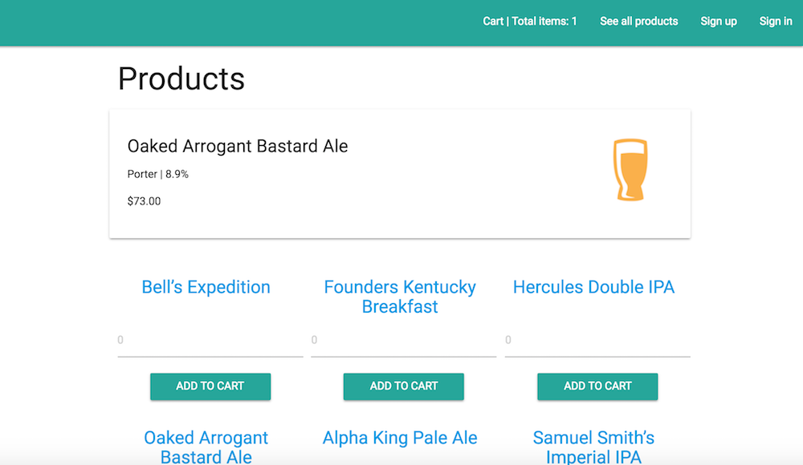
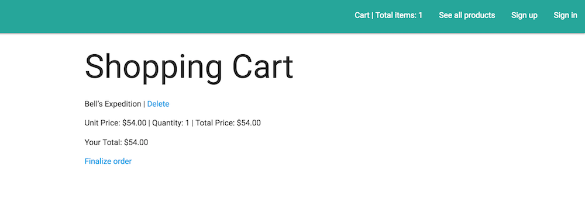

# bEer-commerce Site

#### _Nicky Santamaria_

## Description

An app with a list of products that can be added to a shopping cart.

## Refactor List

1. Ensure that users can't order a negative number of items. (Ensure users must enter a quantity before adding to cart.)
2. Add flash messages for signing up, signing in and signing out.
3. Add product update and delete functionality for admins.
4. Add admin flash messages for adding, updating and deleting products.
5. Add Paperclip for product image upload.
6. Allow other than whole dollar amounts for admin product creation (for instance, 3.99).
7. Add product validations.
8. Add admin links to navbar so admins can easily add products. (Update and delete links are included in the show path for individual products.)
9. Fix the row height for products, which can quickly become uneven.

## Technologies used / Prerequisites

* [Ruby](https://www.ruby-lang.org/en/downloads/)
* [Rails](http://rubyonrails.org/)
* [PostgreSQL](https://www.postgresql.org/docs/9.2/static/app-psql.html)
* [Git](https://git-scm.com/)
* [Materialize](http://materializecss.com/)
* AJAX
* bcrypt

## Installation

* `$ git clone https://github.com/nrsantamaria/went-to-bali-mwahaha`
* `$ cd went-to-bali-mwahaha`

## PostgreSQL Integration
* `$ postgres`
* `$ rake db:create`
* `$ rake db:migrate db:test:prepare`

## Seed database
* `$ rake db:reset`

## Development server

Run `rails s` for a dev server. Navigate to `http://localhost:3000/`. The app will automatically reload if you change any of the source files.

## Specifications

| Behavior |  Input   |  Output  |
|----------|:--------:|:--------:|
|Admin user adds a product to database.|Name => 'Beer', Cost => '5.50', Description => 'Fancy beer.', Image => 'beer.jpeg'| Name: Beer, Cost: $5.50, Description: Fancy beer., Image: beer.jpeg
|Admin user updates product. |Name: Beer, Edit Product Name => 'Fancy Beer'|Name: Fancy Beer|
|Admin user deletes product| Name: Beer, Delete Beer|User is taken to products path. |
|User can add product to cart.|Quantity: '1', Add to Cart|Cart: Beer Name, Quantity: 1|
|User can remove product from cart.|Cart: Beer Name, Quantity: 1 => Delete|Your shopping cart is empty.|

## Known Bugs
* N/A

## License

*This software is licensed under MIT license.*

```
Copyright (c) 2017 Nicky Santamaria
```



